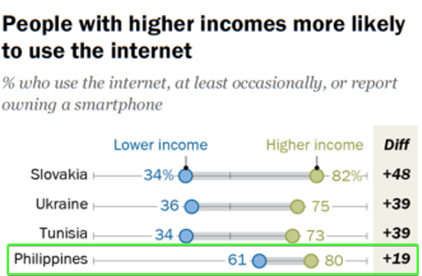
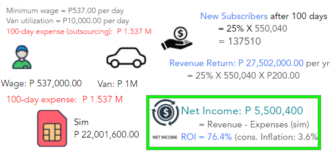
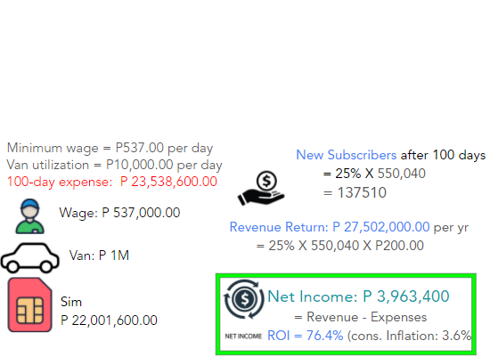

```{r setup, include=FALSE}
knitr::opts_chunk$set(echo = TRUE)
library(tufte)
```
# Target Market Profile
## Economic Status
According to [Pew Research Center](https://www.pewresearch.org/fact-tank/2020/04/02/8-charts-on-internet-use-around-the-world-as-countries-grapple-with-covid-19/ft_2020-04-02_globalinternet_04/), 80% of the high-income bracket Filipinos use internet, while 61% for low-income bracket.

```{r echo=FALSE, out.width='100%'}

```

# Return of Investment
Below states two options in the execution of this project. Outsourced uses the services of the marketing agency while the other scenario, Not Outsourced, uses internal efforts from Globe Telecom.
## Outsourced
It was stated in the case that Globe Telecom will invest PhP 5,000,000 to outsource services to the Marketing Agency.In this scenario, only the sim manufacutring expenses are deducted in the annual Revenue Return.

```{r echo=FALSE, out.width='100%'}

```

## Not Outsourced
In this scenario, the total expenses are deducted from the annual Revenue Return.

```{r echo=FALSE, out.width='100%'}

```

# Percentage Sensitivities
From 100-day expense of P 23,538,600.00...

If conversion rate (25%) is constant, minimum success rate to earn income is 53%. 
If success rate (75%) is constant, minimum conversion rate to earn income is 21.4%.